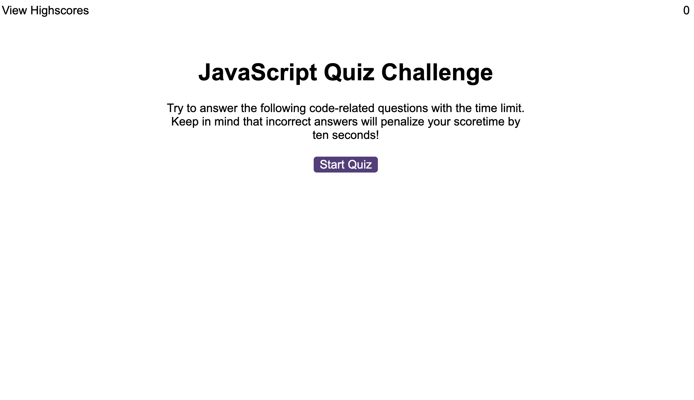
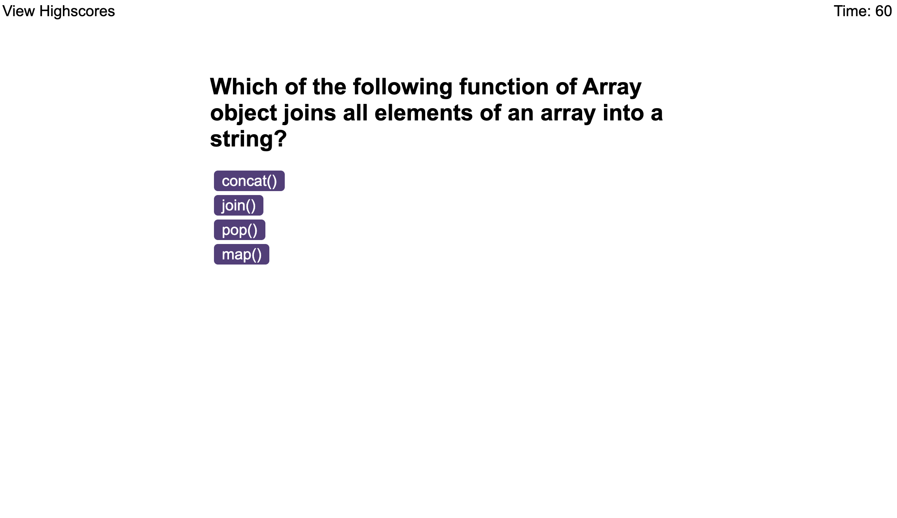
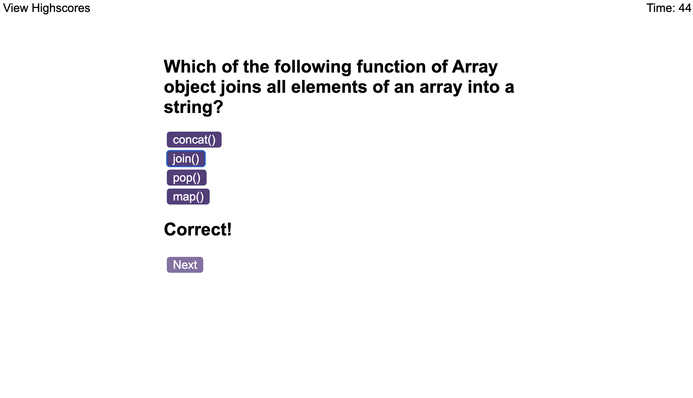
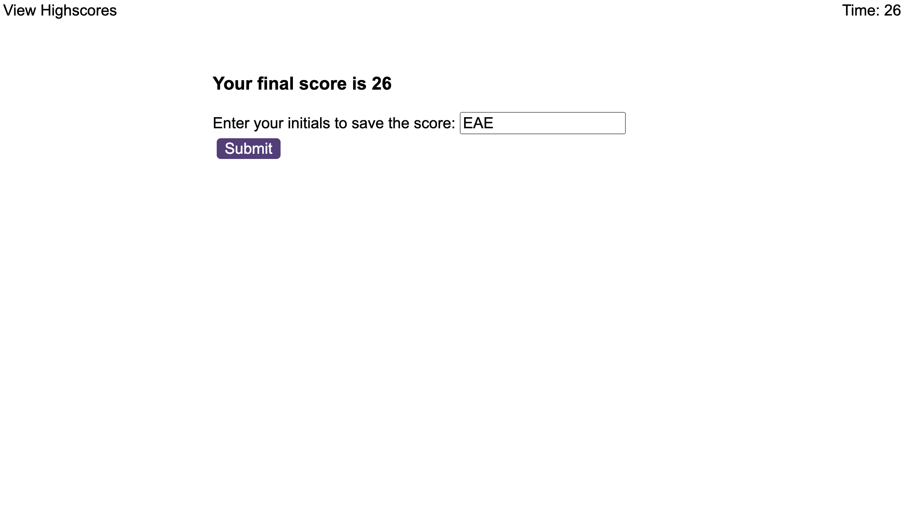

# README
## Description
Javascript quiz game using JS/HTML/CSS

## Repository
https://github.com/betheng/javascript-quiz-game

## Deployment
- Go to gitHub > Site repo > Settings > Pages
- Then deploy to GitHub Pages

Live site link: https://betheng.github.io/javascript-quiz-game/
_____________________________
## Last Updates

6/5/2023 (@betheng)- Deploy
### User Story
AS A coding boot camp student 
I WANT to take a timed quiz on JavaScript fundamentals that stores high scores 
SO THAT I can gauge my progress compared to my peers 

### ACs
GIVEN I am taking a code quiz 
WHEN I click the start button 
THEN a timer starts and I am presented with a question 
WHEN I answer a question 
THEN I am presented with another question 
WHEN I answer a question incorrectly 
THEN time is subtracted from the clock 
WHEN all questions are answered or the timer reaches 0 
THEN the game is over 
WHEN the game is over 
THEN I can save my initials and score 

### Sources
- Class material 
- W3Schools  
- MDN Web Docs  
- https://www.codingnepalweb.com/quiz-app-with-timer-javascript/  
- https://www.codewithrandom.com/2022/08/10/quiz-app-with-timer-javascript/  
- James Q Quick Youtube - High Scores videos of his Quiz App series
- lots of various googling